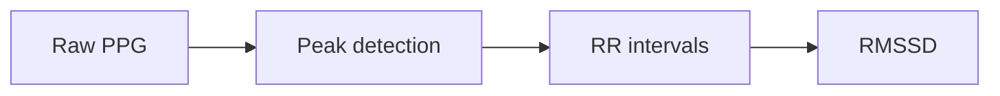

---
# COPY-PASTE TEMPLATE — this file lives in _drafts/ so Jekyll never publishes it.
# To start a real post: copy this file into _posts/ and rename it
# YYYY-MM-DD-your-post-slug.md (see POSTING.md at the repo root for the
# full workflow).
title: "Example Post: RMSSD From Raw RR Intervals"
date: 2026-01-01 09:00:00 -0500
categories: [Wearables, HRV]
tags: [hrv, ppg, python, signal-processing]     # lowercase, hyphenated
math: true      # required on any post using $$...$$ or $...$ math
mermaid: true   # required on any post using ```mermaid fenced blocks
image:
  path: /assets/images/example-post-template/cover.png
  alt: "Placeholder cover image — replace with a real image or delete the `image` block"
---

This is a **template post**, not a real article. It exists only to
demonstrate the front matter fields, a math block, a code block, and the
image convention used across this blog. Delete this paragraph and everything
below it when you start writing for real — keep whichever building blocks
you actually need.

## Math example

The theme renders math via MathJax whenever `math: true` is set in the front
matter above. Inline math looks like this: the root mean square of successive
differences is written $\text{RMSSD} = \sqrt{\frac{1}{N-1}\sum_{i=1}^{N-1}(RR_{i+1}-RR_i)^2}$.

A displayed (block) equation:

$$
\text{RMSSD} = \sqrt{ \frac{1}{N-1} \sum_{i=1}^{N-1} \left( RR_{i+1} - RR_i \right)^2 }
$$

## Code example

Fenced code blocks get syntax highlighting automatically (via Rouge) — no
extra configuration needed:

```python
import numpy as np

def rmssd(rr_intervals_ms: np.ndarray) -> float:
    """Root mean square of successive RR interval differences, in ms."""
    diffs = np.diff(rr_intervals_ms)
    return float(np.sqrt(np.mean(diffs ** 2)))
```

## Image example

Images for a given post live under `assets/images/<post-slug>/` — see
`assets/images/README.md` for the convention. Plain Markdown works and gets
click-to-zoom automatically:

```markdown

```


For a caption, or to break an image out to full viewport width, use the
`image.html` include instead (see `POSTING.md`):



## Video example

```liquid

```



## Mermaid example

Enabled via `mermaid: true` in the front matter above:



## Other front-matter options worth knowing about

- `pin: true` — adds a "Pinned" badge to the post's card on the home page.
- `toc: false` — turns off the auto-generated table of contents for this post
  (it's on by default, set globally in `_config.yml`).
- `comments: false` — disables comments for this post (only relevant once a
  comments provider is configured in `_config.yml`; currently unset).
- `mermaid: true` — enables Mermaid diagrams (` ```mermaid ` fenced blocks)
  if/when needed.

Remove any of the above you don't need when you copy this file for a real
post.
